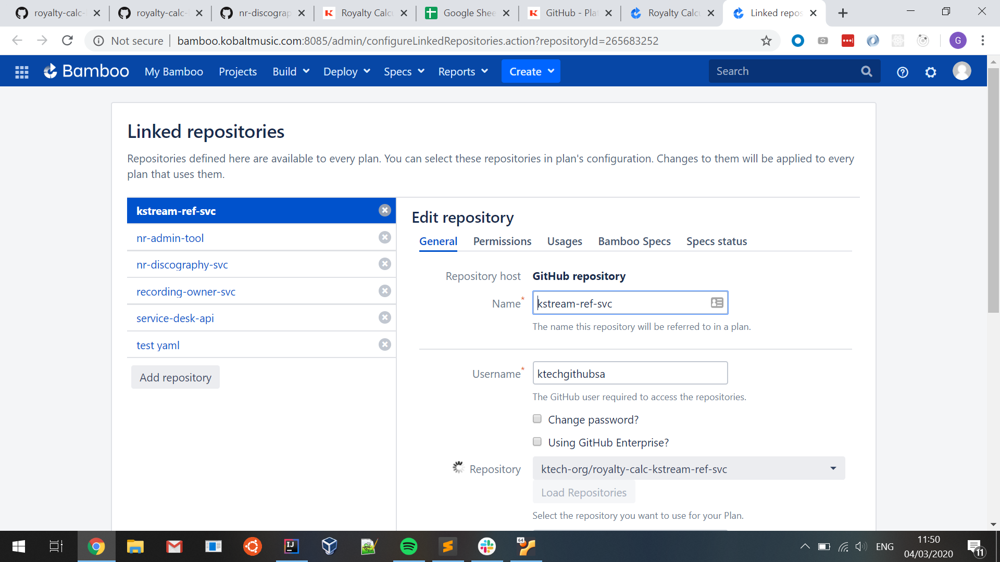
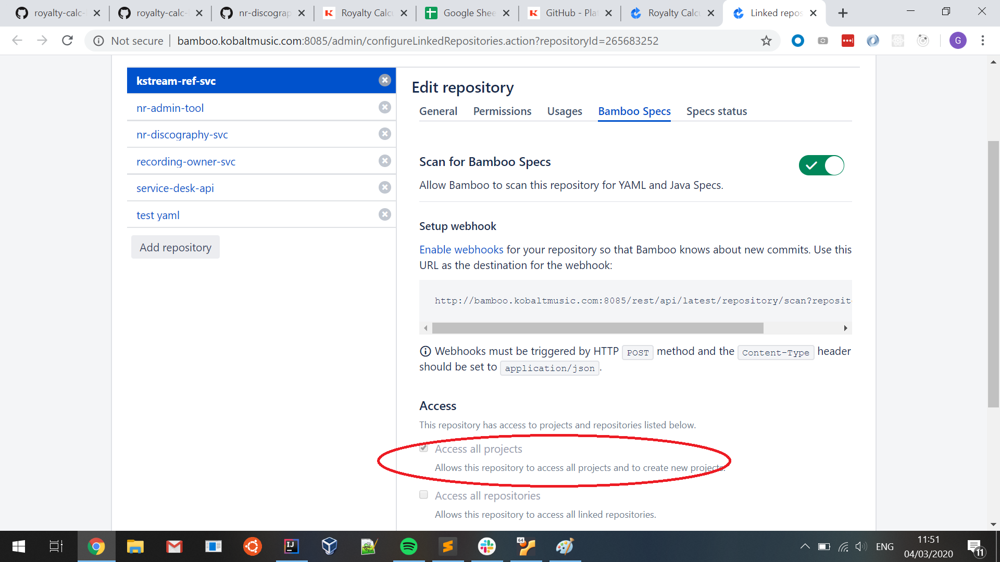

# Bamboo CI/CD Setup

The following document contains instructions on how to set up the CI/CD pipeline for a GitHub repository
using Bamboo specs.

# Background

KTech uses Bamboo specs in yaml mode. The bamboo agent expects the YAML file
to be placed in a `bamboo-specs` directory in the project root. The file, `bamboo.yaml`, should follow
the v2 syntax as defined in the [bamboo specs YAML reference](https://docs.atlassian.com/bamboo-specs-docs/6.9.0/specs.html?yaml), 
and supported by Bamboo version >= `6.9.0`. An example file can be seen [here](../../../bamboo-specs/bamboo.yml)

Although bamboo specs is a major improvement over manual build setup, regrettably there are still a few steps that must be done
manually. Unfortunately, some of these steps can only be done by dedicated Bamboo administrators, which is neither inclusive nor
scalable. To this end, KTech are looking to replace Bamboo with another CI system. However,
for the time being, you will need to follow the steps below (and pair with a Bamboo admin as necessary).

# Instructions

1. Follow the instructions on "How to add support for Bamboo Specs to your GitHub repository" in
[this](https://k-tech.atlassian.net/wiki/spaces/WEBP/pages/1323171845/GitHub) Kwiki page.

2. If using a new Bamboo build project, you will need to manually assign the correct Bamboo agent to the project.
This is done to ensure that the required dependencies are available at build-time. 
To do this, go to Bamboo settings (the gear icon on the navbar) > Elastic Instances > Image Configurations > _Web Elastic Image 18.04_ > Dedicate Image.
Select your bamboo build project (e.g. `Royalty Calculation` and wait for the agent to be restarted for the changes to come into effect.

3. Next, you will need to grant the build plan permission to create deployment projects.
To do this, navigate to the bamboo project (e.g. `Royalty Calculation`) > Project Settings > Bamboo Specs Repositories > select plan name (e.g. `kstream-ref-svc`).
This should take you to a page like this:

On this page, go to the "Bamboo Specs" tab and ensure that the _"Access all projects"_ checkbox is ticked, as below:

4. You will need to manually assign the correct Bamboo agent to the deployment project. Follow the instructions
as per step 2, but this time select the deployment project (e.g. `kstream-ref-svc-deploy`)